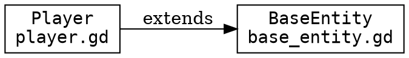
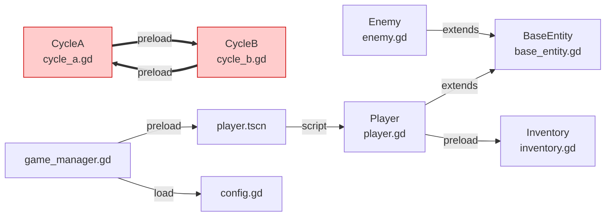

# gdcruiser

Static dependency analyzer for [Godot](https://godotengine.org/) projects, inspired by [dependency-cruiser](https://github.com/sverweij/dependency-cruiser). Parses GDScript (`.gd`) and scene (`.tscn`) files to build a full dependency graph, detect circular dependencies, enforce architectural rules, and export the results as text, JSON, GraphViz DOT, or Mermaid diagrams. Designed to run locally or in CI pipelines.

## Features

- Parses `.gd` and `.tscn` files — `extends`, `preload()`, `load()`, `class_name`, and scene script references
- Detects circular dependencies
- Resolves `class_name` declarations to map symbolic inheritance
- Configurable architectural rules (`forbidden`, `allowed`, `required`, `circular`, `orphan`) via `.gdcruiser.json` or `pyproject.toml`
- Multiple output formats: human-readable text, JSON, GraphViz DOT, and Mermaid
- `--exclude` flag to filter paths from analysis
- Non-zero exit code on cycles or rule violations (CI-friendly)

## Installation

Requires Python 3.13+.

```bash
pip install gdcruiser
```

Or with [uv](https://docs.astral.sh/uv/):

```bash
uv tool install gdcruiser
```

## Usage

```
gdcruiser [-h] [-f {text,json,dot,mermaid}] [-o FILE] [--no-cycles] [-v] [path]
```

| Option | Description |
|--------|-------------|
| `path` | Godot project path (default: current directory) |
| `-f, --format` | Output format: `text` (default), `json`, `dot`, or `mermaid` |
| `-o, --output` | Write output to file instead of stdout |
| `--no-cycles` | Skip cycle detection |
| `-v, --verbose` | Verbose output |

### Examples

Analyze the current directory:

```bash
gdcruiser .
```

Analyze a specific project and output JSON:

```bash
gdcruiser /path/to/godot/project -f json
```

Generate a GraphViz DOT file:

```bash
gdcruiser . -f dot -o deps.dot
dot -Tpng deps.dot -o deps.png
```

Generate a Mermaid diagram:

```bash
gdcruiser . -f mermaid
```

## Output Formats

### Text (default)

```
============================================================
GDScript Dependency Analysis
============================================================

Modules: 9
Dependencies: 8

----------------------------------------
CIRCULAR DEPENDENCIES (1 found)
----------------------------------------

Cycle 1:
  -> res://cycle_b.gd
  -> res://cycle_a.gd
  -> res://cycle_b.gd (back to start)

----------------------------------------
MODULE DEPENDENCIES
----------------------------------------

res://player.gd
  class_name: Player
  extends_class: res://base_entity.gd:2
  preload: res://inventory.gd:5
```

### JSON

```json
{
  "graph": {
    "modules": {
      "res://player.gd": {
        "path": "res://player.gd",
        "class_name": "Player",
        "dependencies": [
          {
            "target": "res://base_entity.gd",
            "type": "extends_class",
            "line": 2,
            "resolved": true
          }
        ]
      }
    },
    "stats": {
      "module_count": 9,
      "dependency_count": 8
    }
  },
  "cycles": [],
  "symbols": {
    "Player": "res://player.gd"
  },
  "errors": []
}
```

### GraphViz DOT



Nodes involved in cycles are highlighted in red.

### Mermaid

Produces a [Mermaid](https://mermaid.js.org/) flowchart that renders natively on GitHub, GitLab, Notion, and other Markdown tools — no external tooling required.

```bash
gdcruiser tests/fixtures -f mermaid
```



Cycle nodes are highlighted with a red fill, and cycle edges use thick arrows.

## Supported Dependency Patterns

gdcruiser detects the following GDScript patterns:

| Pattern | Example |
|---------|---------|
| `extends` (path) | `extends "res://path/to/script.gd"` |
| `extends` (class) | `extends ClassName` |
| `class_name` | `class_name MyClass` |
| `preload()` | `preload("res://path/to/file.gd")` |
| `load()` | `load("res://path/to/file.gd")` |

For `.tscn` files, it detects scripts attached to nodes via `[ext_resource]`.

## Development

Install dependencies:

```bash
uv sync
```

Set up pre-commit hooks:

```bash
uv run pre-commit install
```

This installs hooks for `pre-commit`, `commit-msg`, and `post-checkout` stages. On every commit the hooks will:

- Fix trailing whitespace and line endings
- Lint and format with [Ruff](https://docs.astral.sh/ruff/)
- Run the test suite with pytest
- Enforce [Conventional Commits](https://www.conventionalcommits.org/) for commit messages

Run the CLI:

```bash
uv run gdcruiser
```

Run tests:

```bash
uv run pytest
```

Run linter:

```bash
uv run ruff check .
```

Format code:

```bash
uv run ruff format .
```
