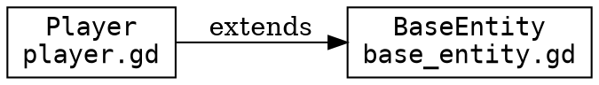
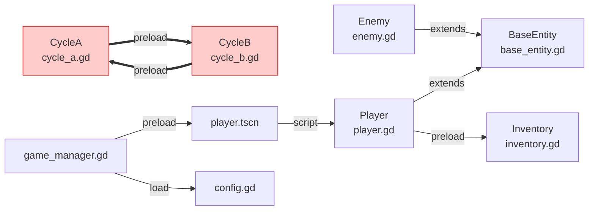

# gdcruiser

Static dependency analyzer for [Godot](https://godotengine.org/) projects, inspired by [dependency-cruiser](https://github.com/sverweij/dependency-cruiser). Parses GDScript (`.gd`) and scene (`.tscn`) files to build a full dependency graph, detect circular dependencies, enforce architectural rules, and export the results as text, JSON, GraphViz DOT, or Mermaid diagrams. Designed to run locally or in CI pipelines.

## Features

- Parses `.gd`, `.tscn`, and `.tres` files — `extends`, `preload()`, `load()`, `class_name`, scene/resource scripts, and class-name expressions in code (`var x: Foo`, `obj is Foo`, `Foo.STATIC_CONST`)
- Reads `[autoload]` from `project.godot` and resolves singleton accesses (`TurnManager.foo`, `EventBus.emit_signal(...)`) to their backing scripts
- Detects circular dependencies
- Resolves `class_name` declarations to map symbolic inheritance
- Configurable architectural rules (`forbidden`, `allowed`, `required`, `circular`, `orphan`) via `.gdcruiser.json` or `pyproject.toml`
- Multiple output formats: human-readable text, JSON, GraphViz DOT, and Mermaid
- `--exclude` flag to filter paths from analysis
- Non-zero exit code on cycles or rule violations (CI-friendly)

## Installation

Requires Python 3.13+.

```bash
pip install gdcruiser
```

Or with [uv](https://docs.astral.sh/uv/):

```bash
uv tool install gdcruiser
```

## Usage

```
gdcruiser [-h] [-f {text,json,dot,mermaid}] [-o FILE] [--no-cycles] [-v] [path]
```

| Option | Description |
|--------|-------------|
| `path` | Godot project path (default: current directory) |
| `-f, --format` | Output format: `text` (default), `json`, `dot`, or `mermaid` |
| `-o, --output` | Write output to file instead of stdout |
| `--no-cycles` | Skip cycle detection |
| `--config FILE` | Path to config file (`.gdcruiser.json` or `pyproject.toml`) |
| `--validate-config` | Validate config file and exit |
| `--ignore-rules` | Skip rule evaluation |
| `--exclude PATTERN` | Regex pattern to exclude paths (can be repeated) |
| `--cache` | Enable incremental parse caching (default file: `.gdcruiser_cache.json`) |
| `--cache-file FILE` | Path to the incremental parse cache (implies `--cache`) |
| `-v, --verbose` | Verbose output |

With caching enabled, unchanged files (matched by modification time and size)
are restored from the cache instead of being re-parsed — useful for large
projects run repeatedly in CI or a pre-commit hook. Symbol resolution and cycle
detection always run fresh, so results are identical to an uncached run. Add
the cache file to your `.gitignore`.

### Examples

Analyze the current directory:

```bash
gdcruiser .
```

Analyze a specific project and output JSON:

```bash
gdcruiser /path/to/godot/project -f json
```

Generate a GraphViz DOT file:

```bash
gdcruiser . -f dot -o deps.dot
dot -Tpng deps.dot -o deps.png
```

Generate a Mermaid diagram:

```bash
gdcruiser . -f mermaid
```

## Output Formats

### Text (default)

```
============================================================
GDScript Dependency Analysis
============================================================

Modules: 9
Dependencies: 8

----------------------------------------
CIRCULAR DEPENDENCIES (1 found)
----------------------------------------

Cycle 1:
  -> res://cycle_b.gd
  -> res://cycle_a.gd
  -> res://cycle_b.gd (back to start)

----------------------------------------
MODULE DEPENDENCIES
----------------------------------------

res://player.gd
  class_name: Player
  extends_class: res://base_entity.gd:2
  preload: res://inventory.gd:5
```

### JSON

```json
{
  "graph": {
    "modules": {
      "res://player.gd": {
        "path": "res://player.gd",
        "class_name": "Player",
        "dependencies": [
          {
            "target": "res://base_entity.gd",
            "type": "extends_class",
            "line": 2,
            "resolved": true
          }
        ]
      }
    },
    "stats": {
      "module_count": 9,
      "dependency_count": 8
    }
  },
  "cycles": [],
  "symbols": {
    "Player": "res://player.gd"
  },
  "errors": []
}
```

### GraphViz DOT


```dot
digraph dependencies {
    rankdir=LR;
    node [shape=box, fontname="monospace"];

    "res://player.gd" [label="Player\nplayer.gd"];
    "res://base_entity.gd" [label="BaseEntity\nbase_entity.gd"];

    "res://player.gd" -> "res://base_entity.gd" [label="extends"];
}
```

Nodes involved in cycles are highlighted in red.

### Mermaid

Produces a [Mermaid](https://mermaid.js.org/) flowchart that renders natively on GitHub, GitLab, Notion, and other Markdown tools — no external tooling required.

```bash
gdcruiser tests/fixtures -f mermaid
```


```mermaid
graph LR
    res_base_entity_gd["BaseEntity<br/>base_entity.gd"]
    res_config_gd["config.gd"]
    res_cycle_a_gd["CycleA<br/>cycle_a.gd"]
    res_cycle_b_gd["CycleB<br/>cycle_b.gd"]
    res_enemy_gd["Enemy<br/>enemy.gd"]
    res_game_manager_gd["game_manager.gd"]
    res_inventory_gd["Inventory<br/>inventory.gd"]
    res_player_gd["Player<br/>player.gd"]
    res_player_tscn["player.tscn"]

    res_cycle_a_gd == preload ==> res_cycle_b_gd
    res_cycle_b_gd == preload ==> res_cycle_a_gd
    res_enemy_gd -- extends --> res_base_entity_gd
    res_game_manager_gd -- preload --> res_player_tscn
    res_game_manager_gd -- load --> res_config_gd
    res_player_gd -- extends --> res_base_entity_gd
    res_player_gd -- preload --> res_inventory_gd
    res_player_tscn -- script --> res_player_gd

    classDef cycle fill:#ffcccc,stroke:#cc0000
    class res_cycle_a_gd,res_cycle_b_gd cycle
```

Cycle nodes are highlighted with a red fill, and cycle edges use thick arrows.

## Supported Dependency Patterns

gdcruiser detects the following GDScript patterns:

| Pattern | Example |
|---------|---------|
| `extends` (path) | `extends "res://path/to/script.gd"` |
| `extends` (class) | `extends ClassName` |
| `class_name` | `class_name MyClass` |
| `preload()` | `preload("res://path/to/file.gd")` |
| `load()` | `load("res://path/to/file.gd")` |
| Typed annotation | `var x: ClassName`, `func f(c: ClassName) -> ClassName:` |
| Generic parameter | `Array[ClassName]`, `Dictionary[String, ClassName]` |
| Type check / cast | `obj is ClassName`, `obj as ClassName` |
| Static / constant access | `ClassName.method()`, `ClassName.CONSTANT` |

Class-name references (the last four rows) are resolved against `class_name` declarations in the project. Built-in Godot types (`Node`, `Vector2`, `Resource`, …) and unresolved identifiers are filtered out so the graph stays clean.

For `.tscn` files, it detects scripts attached to nodes via `[ext_resource]`.

For `.tres` files, it detects:

- `script_class="ClassName"` in the `[gd_resource]` header (registers the resource under that class name in the symbol table).
- Every `[ext_resource path="res://..."]` reference — to scripts, sub-resources, or scenes — so architectural rules can constrain the data layer.

### Autoload singletons

When a `project.godot` file is present at the project root, gdcruiser parses its `[autoload]` section:

```ini
[autoload]
TurnManager="*res://scripts/autoload/turn_manager.gd"
EventBus="*res://scripts/autoload/event_bus.gd"
```

Each identifier is registered as a global symbol pointing at its backing script (the leading `*` is stripped). Subsequent `TurnManager.foo` or `EventBus.emit_signal(...)` accesses anywhere in the project resolve to that script the same way `class_name` references do — so a rule like `forbidden: { from: "scripts/skills/", to: "scripts/autoload/" }` fires on its own without any extra configuration.

References inside string literals and comments are ignored.

## Custom Rules

gdcruiser can enforce architectural rules on your dependency graph. Rules are defined in `.gdcruiser.json` (or `pyproject.toml` under `[tool.gdcruiser]`) and evaluated with every run unless `--ignore-rules` is passed.

### Configuration file

gdcruiser looks for config files in this order:

1. `--config <path>` (explicit)
2. `.gdcruiser.json` in the project root
3. `gdcruiser.json` in the project root
4. `[tool.gdcruiser]` section in `pyproject.toml`

### Rule types

| Type | Meaning |
|------|---------|
| `forbidden` | Dependency **must not** exist — a violation is raised when a matching edge is found |
| `allowed` | Only listed dependencies are permitted — anything else from a matching source is a violation |
| `required` | Dependency **must** exist — a violation is raised when a matching source has no edge to the target |

### Rule fields

| Field | Type | Description |
|-------|------|-------------|
| `name` | string | Rule identifier shown in violation messages |
| `severity` | `"error"` \| `"warn"` \| `"info"` \| `"ignore"` | Severity level (default: `"error"`) |
| `comment` | string | Human-readable explanation |
| `from.path` | regex | Match source modules whose path matches |
| `from.pathNot` | regex | Exclude source modules whose path matches |
| `to.path` | regex | Match target modules whose path matches |
| `to.pathNot` | regex | Exclude target modules whose path matches |
| `circular` | bool | Flag the rule as a circular-dependency check (forbidden only) |
| `orphan` | bool | Flag the rule as an orphan-module check (forbidden only) |

Path patterns are regular expressions matched with `re.search`, so they can match any substring of the `res://` path.

### Examples

#### Forbid a dependency between two layers

Prevent UI scripts from importing game logic directly:

```json
{
  "forbidden": [
    {
      "name": "no-ui-to-core",
      "comment": "UI must not depend on core game logic",
      "from": { "path": "ui/" },
      "to": { "path": "core/" }
    }
  ]
}
```

#### Restrict allowed dependencies

Only allow player scripts to depend on modules under `shared/` or `components/`:

```json
{
  "allowed": [
    {
      "name": "player-deps",
      "from": { "path": "player/" },
      "to": { "path": "(shared|components)/" }
    }
  ]
}
```

#### Require a dependency

Ensure every autoload script preloads `config.gd`:

```json
{
  "required": [
    {
      "name": "autoloads-need-config",
      "from": { "path": "autoloads/" },
      "to": { "path": "config\\.gd$" }
    }
  ]
}
```

#### Forbid circular dependencies in specific modules

```json
{
  "forbidden": [
    {
      "name": "no-cycles-in-core",
      "circular": true,
      "from": { "path": "core/" }
    }
  ]
}
```

#### Detect orphan modules

Flag modules that have no dependencies and no dependents:

```json
{
  "forbidden": [
    {
      "name": "no-orphans",
      "severity": "warn",
      "orphan": true,
      "from": { "pathNot": "autoloads/" }
    }
  ]
}
```

#### Exclude paths from rule evaluation

```json
{
  "options": {
    "exclude": ["addons/", "test/"]
  },
  "forbidden": [
    {
      "name": "no-core-to-ui",
      "from": { "path": "core/" },
      "to": { "path": "ui/" }
    }
  ]
}
```

#### pyproject.toml equivalent

```toml
[tool.gdcruiser.options]
exclude = ["addons/"]

[[tool.gdcruiser.forbidden]]
name = "no-ui-to-core"
severity = "error"
comment = "UI must not depend on core game logic"

[tool.gdcruiser.forbidden.from]
path = "ui/"

[tool.gdcruiser.forbidden.to]
path = "core/"
```

### Running with rules

```bash
gdcruiser . --config .gdcruiser.json        # explicit config
gdcruiser .                                  # auto-discovers config
gdcruiser . --ignore-rules                   # skip rule evaluation
gdcruiser . --config rules.json -f json      # violations in JSON output
gdcruiser . --validate-config                # validate config and exit
```

The exit code is non-zero when any `error`-severity violation is found.

## Pre-commit Hook

gdcruiser can run as a [pre-commit](https://pre-commit.com/) hook to catch dependency violations on every commit. Add the following to your Godot project's `.pre-commit-config.yaml`:

```yaml
repos:
  - repo: https://github.com/Thurbeen/gdcruiser
    rev: v1.0.0  # use the latest release tag
    hooks:
      - id: gdcruiser
```

By default the hook runs `gdcruiser . --no-cycles` and only triggers when `.gd` or `.tscn` files are changed.

To customize the behavior, pass additional arguments via `args`:

```yaml
hooks:
  - id: gdcruiser
    args: ["--config", "rules.json"]
```

```yaml
hooks:
  - id: gdcruiser
    args: ["--exclude", "addons"]
```

If any rule violation is found the hook exits with a non-zero code and blocks the commit.

## Development

Install dependencies:

```bash
uv sync
```

Set up pre-commit hooks:

```bash
uv run pre-commit install
```

This installs hooks for `pre-commit`, `commit-msg`, and `post-checkout` stages. On every commit the hooks will:

- Fix trailing whitespace and line endings
- Lint and format with [Ruff](https://docs.astral.sh/ruff/)
- Run the test suite with pytest
- Enforce [Conventional Commits](https://www.conventionalcommits.org/) for commit messages

Run the CLI:

```bash
uv run gdcruiser
```

Run tests:

```bash
uv run pytest
```

Run linter:

```bash
uv run ruff check .
```

Format code:

```bash
uv run ruff format .
```
